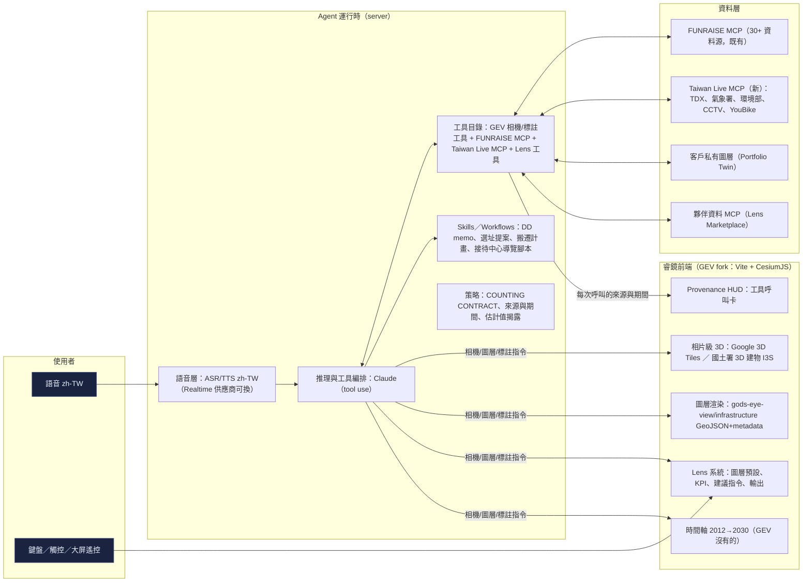

# 06 · 架構：GEV 基座 × FUNRAISE MCP × 台灣即時 API × Agent 運行時

## 1. 總覽

## 2. 前端：為什麼 fork GEV 而不是從零做

- GEV 已解決最貴的部分：Cesium 上的 Google 3D Tiles、渲染節流（render governor）、相機動詞（fly_to／orbit／track／route）、標註（annotate_map）、感測風格（7 種 GLSL）、面板佈局引擎、232 個單元測試。
- **我們的資料是多邊形＋屬性**（大樓、都更單元、地籤、分區、園區），GEV 的 `gods-eye-view/infrastructure` 套件（Datacenters／Dams 用的）就是為 GeoJSON＋metadata 設計的：`createLocalGeoJsonLayer` → `registerEntityContext(entity, metadata)`，自動獲得點選、LOD、`get_entity_context`／`analyst_query` 支援。**大部分圖層不需要自寫渲染**。
- 要改的地方：`src/locations.js` 的 `CITY_POIS` 加台灣城市；三個工具 schema 的城市 enum 同步；`server/providers/` 加 MCP 轉接與 Taiwan Live 代理；`src/layers/<name>/` 依慣例新增圖層；`DATA_SOURCES.md`／`dataCredits.js` 登錄每個來源。
- **新增而非改造**：時間軸（全域 `year` 狀態影響每個圖層的可見性與樣式，未來建物為幽靈、完工年變實體）、Lens 系統、Provenance HUD。

## 3. 3D 底圖策略

| 選項 | 優點 | 成本／限制 | 用法 |
|---|---|---|---|
| Google Photorealistic 3D Tiles（直接金鑰） | 雙北、桃園、台中已有相片級 3D；GEV 原生 | 商用需直接計量金鑰（Cesium ion Community 僅限非商用）；依 session 計費 | 展示、接待中心、街景鏡 |
| 國土署 3D 圖臺（I3S／3D Tiles） | 全國 539 萬棟 3D 建物、政府資料；Cesium 可載 | 精度與 Google 對應關係待驗證；授權條款要確認 | 全國覆蓋、城市治理鏡、學研 |
| 自建擠出（建物樓層 × 樓高） | 零成本、完全可控、可做「未來建物」 | 非相片級 | 未來供給幽靈建物、原型 |
| 國土測繪中心 EMAP／正射影像 WMTS | 免申請、全國 | 2D | 底圖與 fallback |

原型（本 repo）用第三種：純 Canvas 2.5D 擠出，證明體驗與資料，不綁任何金鑰。

## 4. Agent 運行時

- **語音層可換**：GEV 只支援 OpenAI Realtime；我們把 ASR／TTS 抽成獨立服務（第一階段沿用 OpenAI Realtime 求快，第二階段評估 zh-TW 表現更好的供應商），推理與工具編排交給 Claude（tool use）；瀏覽器只拿短效 token，金鑰留在伺服器（GEV 既有模式）。
- **工具目錄三層**：GEV 相機／標註／圖層工具（約 28 個）＋ FUNRAISE MCP（30+）＋ Lens 工具（set_lens、set_year、export_memo、open_in_pickpeak、subscribe_radar）。Claude 直接以 MCP 客戶端連 FUNRAISE MCP，**不重寫任何資料工具**。
- **策略提示**：借 GEV 的「COUNTING CONTRACT」（回答「附近有幾個」時必須說清範圍與筆數）與「RECONSTRUCTED ESTIMATE」揭露慣例；加上 FUNRAISE 的「每筆結論附資料來源與期間」。
- **Skills／Workflows**：AI Raiser 產出的 Skill 直接掛進工具目錄；語音「幫我做 DD」= 呼叫 dd-memo 生命週期 → 分區 → 承租戶 → 謄本清冊 → 生成備忘錄。
- **地圖即工具（Map-as-a-Tool）**：MCP 新增 `render_map_view` 工具，回傳一個帶狀態（圖層、鏡頭、年份、標註）的可分享睿鏡連結，讓 Claude／ChatGPT 使用者一句話開地圖。

## 5. Taiwan Live MCP（新的開源子專案）

把台灣真即時的公開資料做成 MCP 伺服器，開源以建立生態：
- TDX：公車／捷運即時位置、YouBike、停車場、路況與 CCTV 清單。
- 氣象署：觀測、颱風、地震；環境部：空品。
- 高公局／北市交通局公開 CCTV 影像（投影進 3D，GEV 的 CCTV 模式）。
- 每個工具回傳 `observed_at`／`source`／`license`，餵給 Provenance HUD。

## 6. 資料新鮮度即產品

- 每個圖層帶 `data_as_of` 與 `promised_cadence`（例：實價登錄「每月 1 日」、公司登記「月＋季」、MOPS「即時」）。
- Provenance HUD 顯示「快照 vs 承諾」的差距；差距超過門檻就變黃。
- 這是對遠雄提出的「更新頻率不一致」最直接的回應，也是企業版合約的 SLA 條款。

## 7. 部署與成本（第一年）
- 前端靜態託管＋Agent 伺服器（Node）＋ MCP 既有基礎設施；私有部署走容器。
- 變動成本：3D tiles session、語音分鐘、模型 token；每個付費方案內含額度。
- 團隊：前端／3D 2、Agent 與工具 2、資料 1（PI 團隊既有）、設計 1、PM 1（Nelsen 的 Experience 組織可直接承接）。

## 8. 授權與合規（摘要，詳見 08）
- 程式碼 MIT，但刪除 CC BY-NC-SA 的海纜資料；OpenSky／Esri／Google News 等 GEV 內建來源與台灣產品無關，直接關閉。
- 政府開放資料依政府資料開放授權條款；OSM 圖資標註 ODbL；Google 3D Tiles 依商用條款。
- 個資：不做具名個人搜尋、人臉辨識、個人追蹤；謄本以二類（去識別化）為預設；公司登記為法人公開資料。
